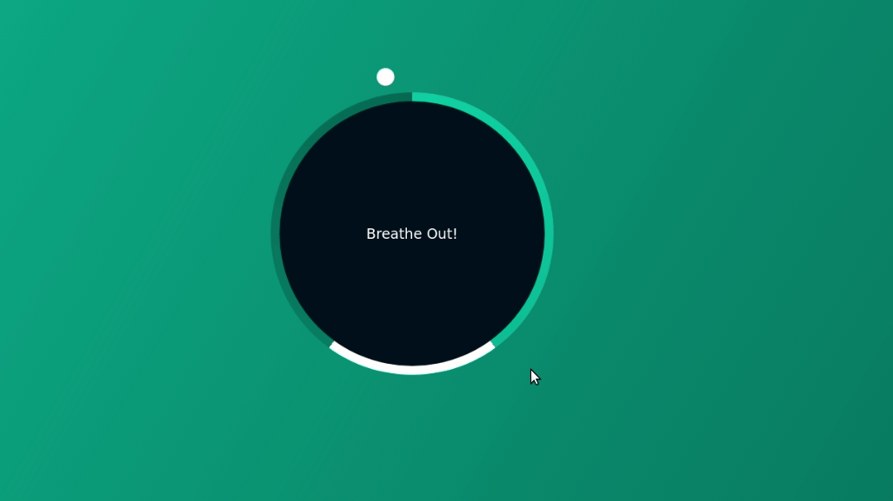

#### Timer relaxer HTML + CSS + JS

Feel free to use the code shared here, improvements and criticisms are always accepted.

Timer to help during programming hours, assimilating the correct way to 'Breathe In' and 'Breathe Out', can be reproduced in react, vue, angular and other frameworks for frontend easily.

